# Git for Windowsのインストール方法
(一応記事を書いてみたけど、デフォルトのまま進んでも問題なさそう)

1. git for Windows をダウンロードします。
https://git-scm.com/download/win
2. ダウンロードしたファイルと実行します。ライセンス画面が表示されるので、「next」を押します。
   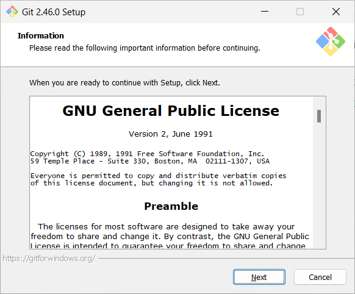
3. インストール先を指定して、「next」を押します。
   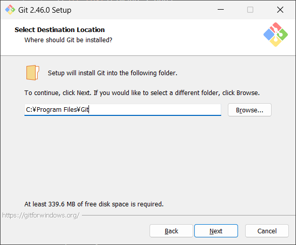
4. インストールする機能を選びます。通常は、デフォルトのままで大丈夫です。機能を選択したら、「next」を押します。
   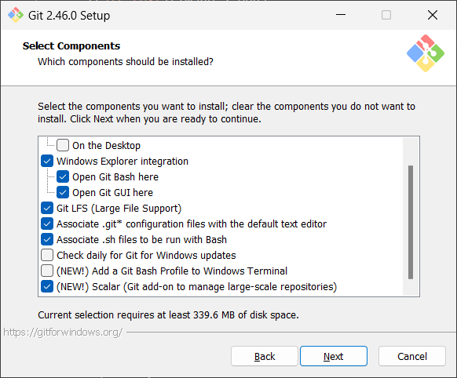
5. 作成するスタートメニューの名前を指定します。通常は、デフォルトのままで大丈夫です。入力したら、「next」を押します。
   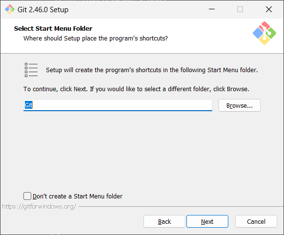
6. 次にデフォルトのエディタを選びます。ここは微妙ですが、デフォルトのままでも大丈夫です。好みのエディタがあればそちらを使ってもOKです。設定したら、「next」を押します。
   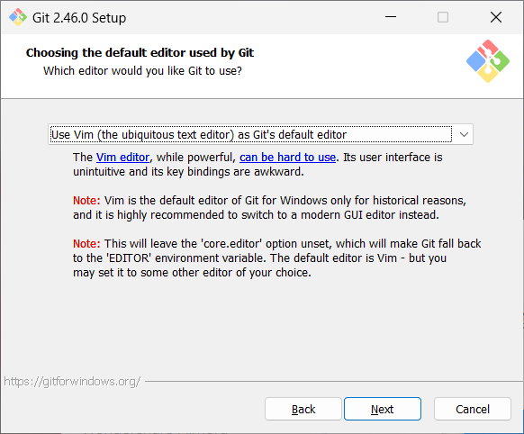
7. gitのブランチを作るときのデフォルト値を設定します。通常は、デフォルトのままで大丈夫です。設定したら「next」を押してください。
   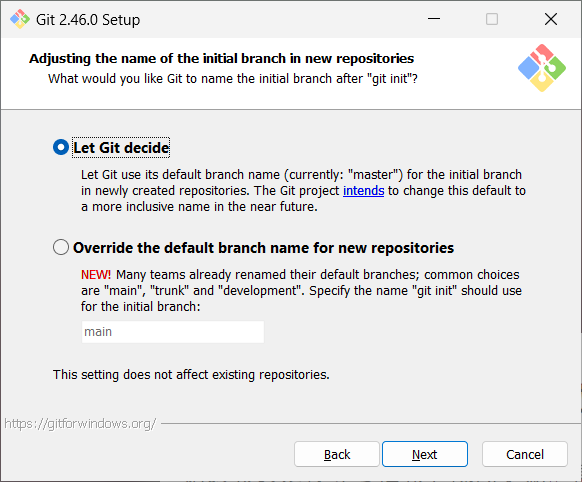
8. gitを使うための環境の設定です。デフォルトのままで大丈夫です。
   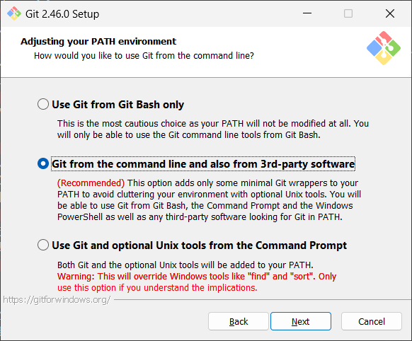
9.  gitがサーバーとの通信で利用するsshを設定します。デフォルトのままで大丈夫です。
   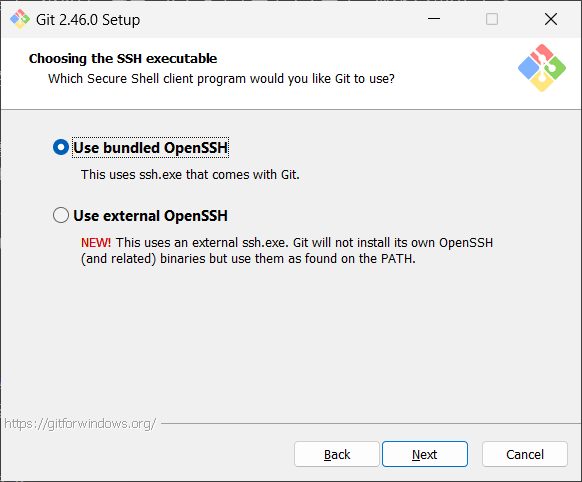
10. gitがhttpsで接続するときに利用するソフトウェアを指定します。デフォルトのままで大丈夫です。
   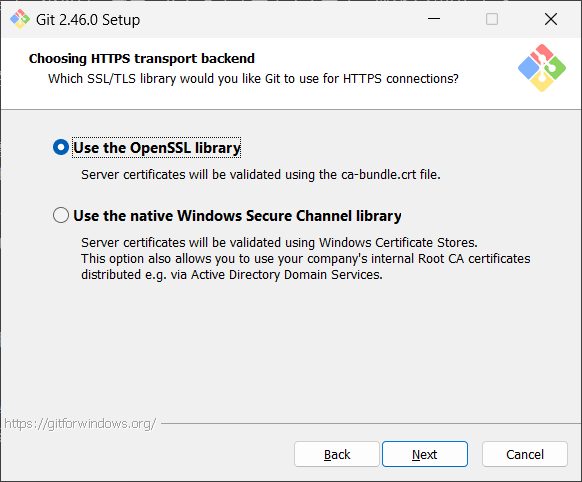
11. 改行コードの取り扱いを指定します。こちらもデフォルトのままで大丈夫です。
   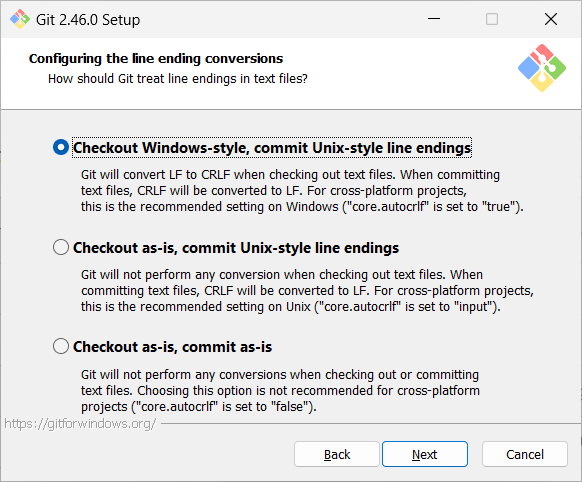
12. こちらはGitコマンドのウィンドウで使う端末の設定です。こちらもデフォルトのままで大丈夫です。
   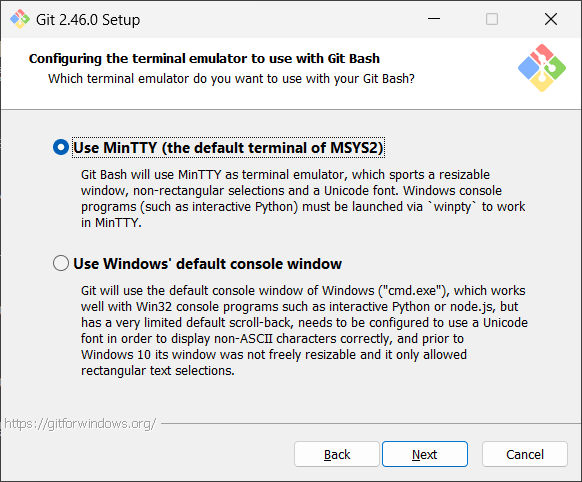
13. こちらはpullコマンドを実行した際の挙動の設定です。こちらもデフォルトのままで大丈夫です。
   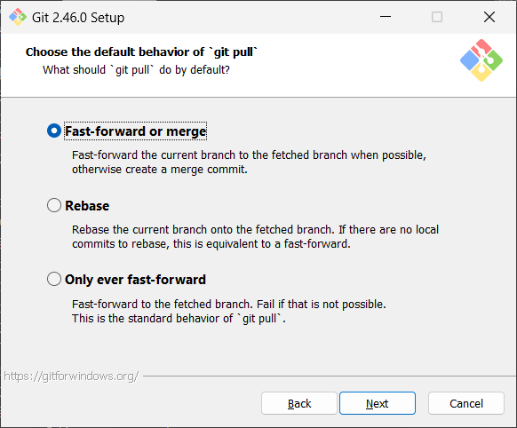
14. こちらはpullコマンドを実行した際の挙動の設定です。こちらもデフォルトのままで大丈夫です。

このあとも、以下の画面が続きますが、デフォルトのままで大丈夫です。
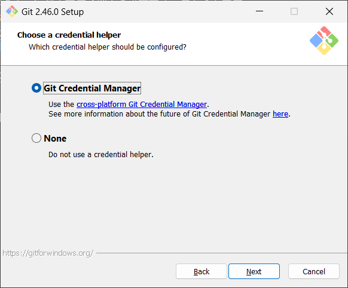

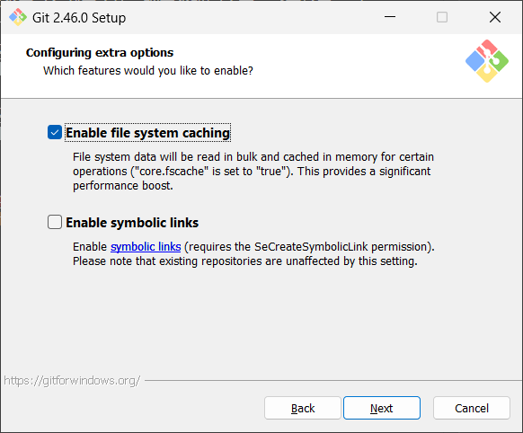

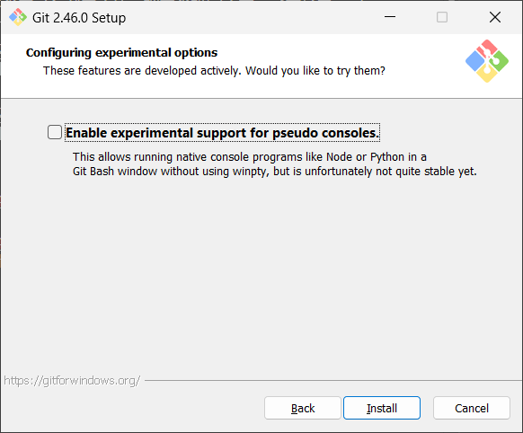

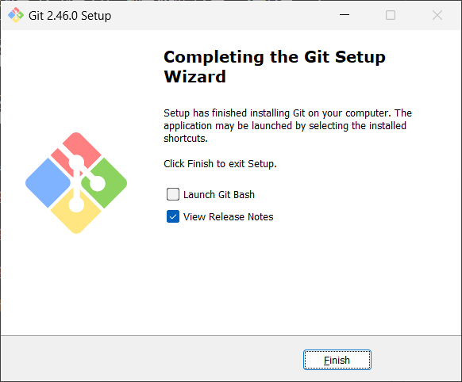

以上でgit for Windowsのインストールは完了です。お疲れ様でした。
