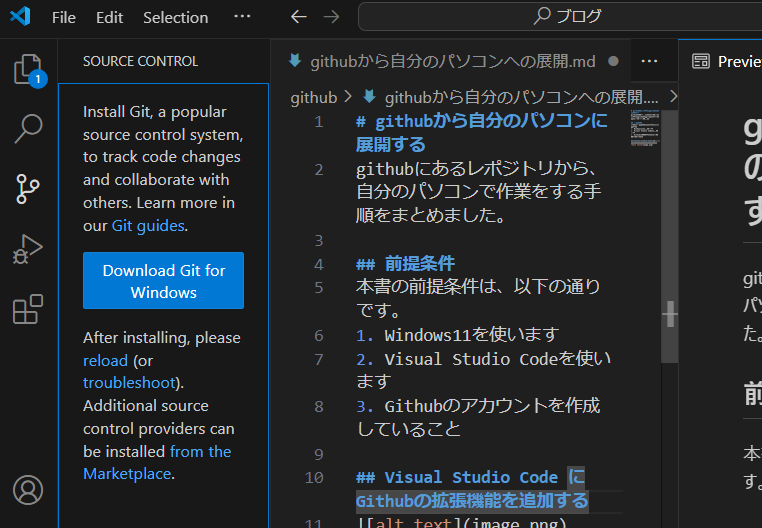

# githubから自分のパソコンに展開する
githubにあるレポジトリから、自分のパソコンで作業をする手順をまとめました。

## 前提条件
本書の前提条件は、以下の通りです。
1. Windows11を使います
2. Visual Studio Codeを使います
3. Githubのアカウントを作成していること

## Visual Studio Code にGithubの拡張機能を追加する
1. Visul Studio Codeのサイドメニューで、上から3つめの項目(Source Control)を選択するします。「Download Git for Windows」を選択します。
