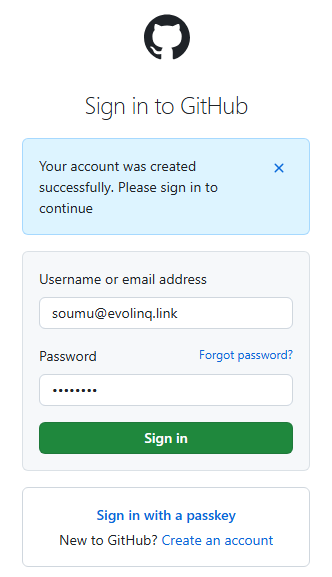

# github アカウントの作成方法(2024/8/18版)
## githubとは
githubは、プログラムなどの成果物を、WEB上で公開したり、版管理したりできるサービスです。成果物をチーム・コミュニティで開発するときによく使われます。URLは、https://github.com/ です。

## アカウントの作成
1. githubのサイトにアクセスします。
https://github.com/
2. emailアドレスに利用者のメールアドレスを入力して、「Sign up for Github」ボタンをクリックします。

3. 確認画面が表示されるので、「Continue」ボタンを押します。

4. パスワード入力が求められるので、15文字以上または数字・文字を含む8文字以上のいずれかを満たすパスワードを入力してください。

5. ユーザー名入力が求められるので、github上で重複しない文字列を入力してください。

6. githubからの案内メールが必要であれば、チェックを入れて、「Continue」ボタンを押してください。

7. アカウントの保護について、設定をしてください。

8. 登録したメールアドレスに、届いているコードを入力してください。

9. コードを入力すると、githubのログイン画面に切り替わります。

10. 根ほり葉ほり訊かれますが、適当に答えるか、スキップしてください。

以上でgithubのアカウント作成は完了です。お疲れ様でした。
