# XAMPPのインストール
## 公式サイトからダウンロード
https://www.apachefriends.org/jp/index.html  
お使いの環境に合致したプログラムをダウンロードしてください。 
（このサイトでは、Windows版をインストールします）
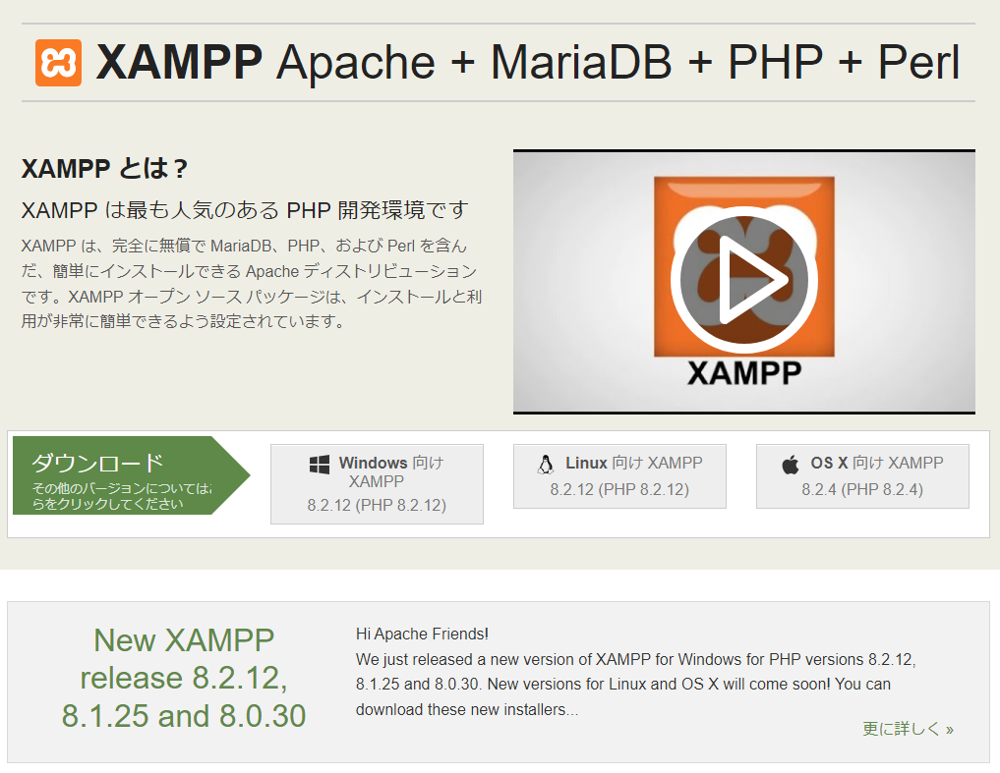

XAMPPのダウンロードが始まります。
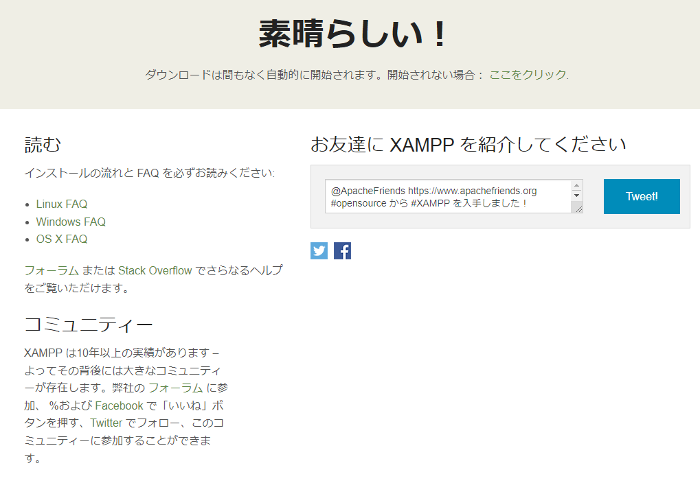

ダウンロードしたインストーラーを実行します。 
記事作成時点では、xampp-windows-x64-8.2.12-0-VS16-installer でした。
実行すると警告が表示されます。警告は、C:\Program Filesフォルダは避けてくれという意味のようです。
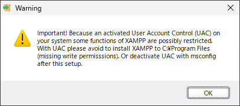

インストールが起動したら、まずは、「Next」を押します。
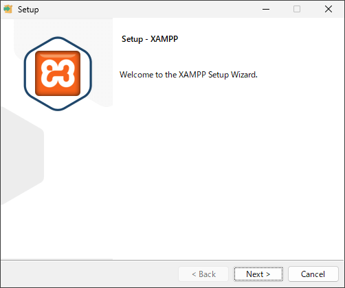

インストールするコンポーネントを選択します。今回は、デフォルトのままインストールを行います。「Next」を押して、進めます。
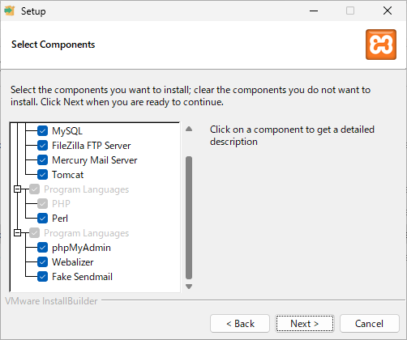

次に、インストール先を指定します。今回は、デフォルトのまま「C:\xampp」で進めます。「Next」を押してください。
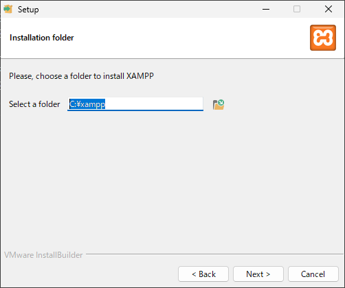

言語は、英語かドイツ語しかないので、英語を選びます。
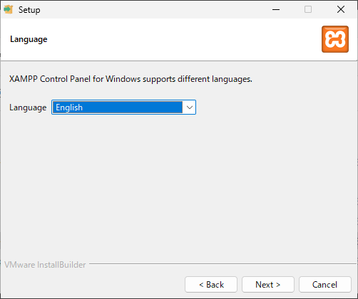

選択肢は、これで終わりです。「Next」を押してください。
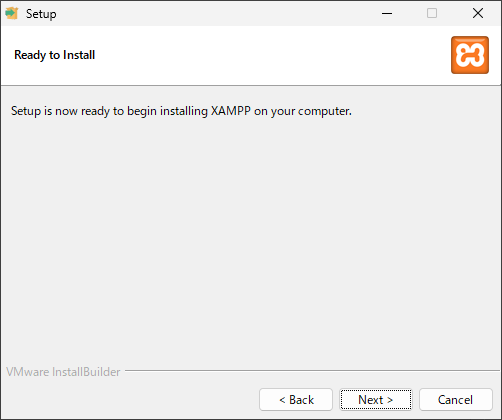

XAMPPのインストールが始まります。

途中、Apacheの通信許可の確認がでますので、「許可」を選びます。その後、インストールが完了します。
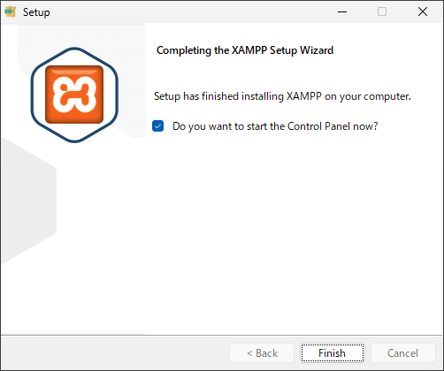

インストールが完了すると、以下の画面が表示されます。
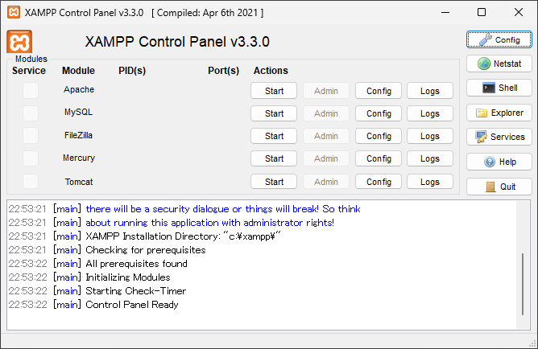

## Apacheの動作確認
まずは、WEBサーバーであるApacheの動作確認をします。Apacheの行にある、「Start」を押します。
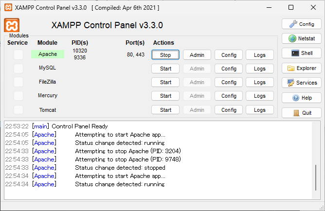

その後、WEBブラウザを立ち上げて、http://localhost を表示します。以下の画面(ダッシュボード)が表示されば、Apacheの動作確認は、完了です。
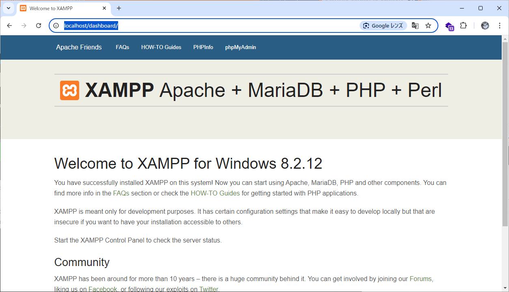

## MySQL(MariaDB)の動作確認
次に、MySQL(・・・というよりは、MariaDBが正しい)の動作確認をします。表示しているダッシュボードから、「phpMyAdmin」を押します。

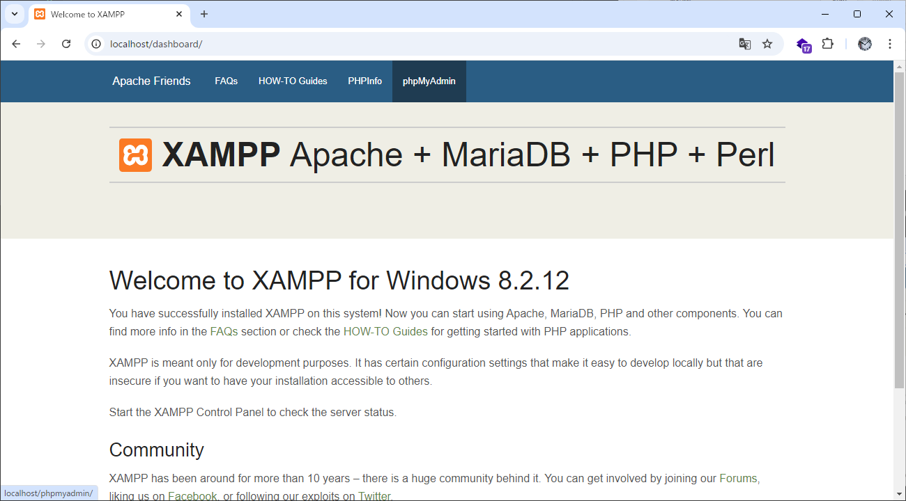

画面の左側には、データベース（infomation_schemaやmysqlなど）が表示されていれば動作しています。
