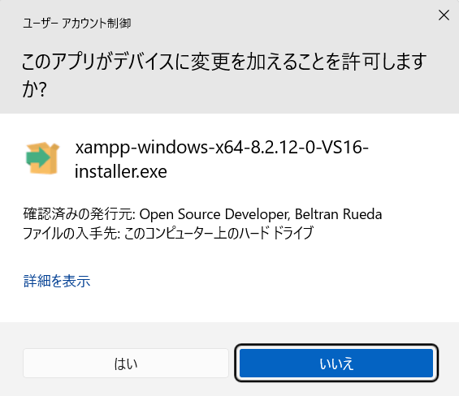
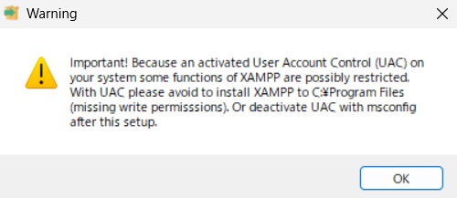
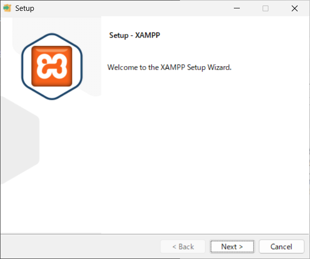
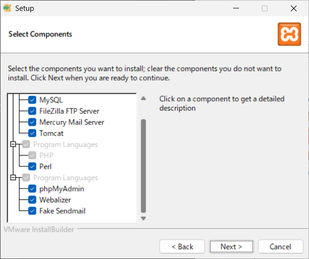
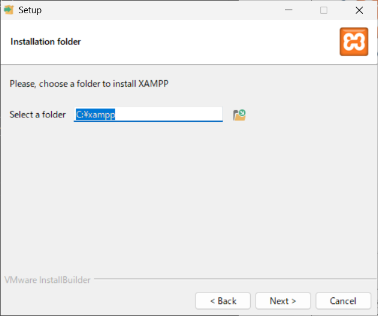
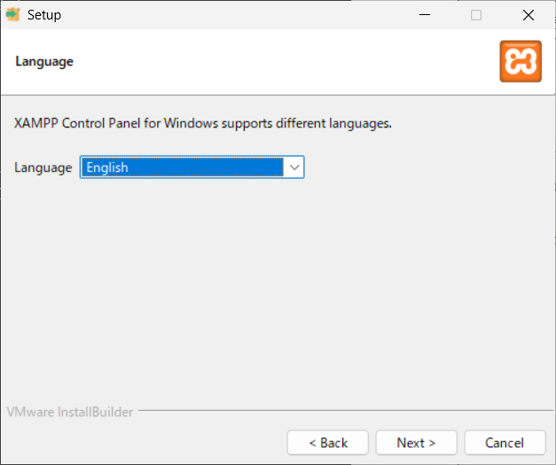
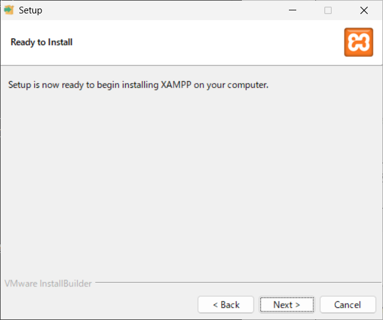
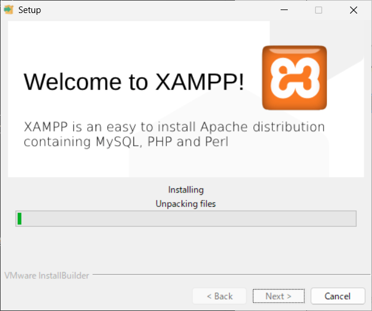
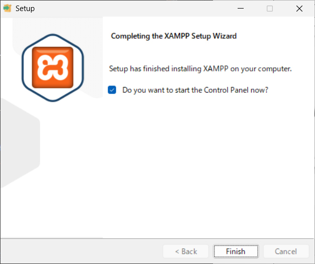

# 災図の開発環境構築方法(Windows版)
以下は、Windows11で試した例です。

## 必要なソフトウェアとインストール・設定方法
1. Visual Studio Code
こちらのサイトやMicrosoft Storeからインストールします。
https://code.visualstudio.com/Download
2. xampp
    1. こちらのサイトからダウンロードします。
    https://www.apachefriends.org/jp/
    2. ダウンロードしたインストーラーを実行します。インストールには、管理者権限が必要です。
    
    3. 続けてメッセージが表示されます。このメッセージは警告です。C:\Program Files\ フォルダへのインストールはやめてくれ、です。
    
    4. この画面はそのまま「next」です。
    
    5. 次の画面もそのまま「next」です。
    
    6. 次の画面もそのまま「next」です。
    
    7. 次の画面もそのまま「next」です（言語は、英語かドイツ語しか選択できません）。
    
    8. 次の画面もそのまま「next」です。
    
    9. インストールが始まります。
    
    10. 何もせずに終了まで進みます。これでひとまず、インストールは完了です。
    
3. githubのアカウントを作る
   こちらを参考にGithubのアカウントを作成してください。
   https://www.evolinq.link/ja/evolution-linked-records/github-%E3%82%A2%E3%82%AB%E3%82%A6%E3%83%B3%E3%83%88%E3%81%AE%E4%BD%9C%E6%88%90%E6%96%B9%E6%B3%952024/8/18%E7%89%88

   
## 災図に本体を入手する
災図の本体は、Githubに公開されています。URLは、以下の通りです。
https://github.com/KishiYuuki/saiz

